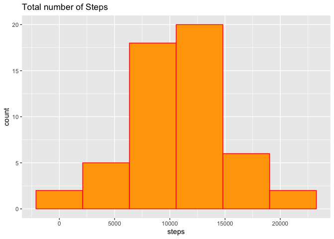
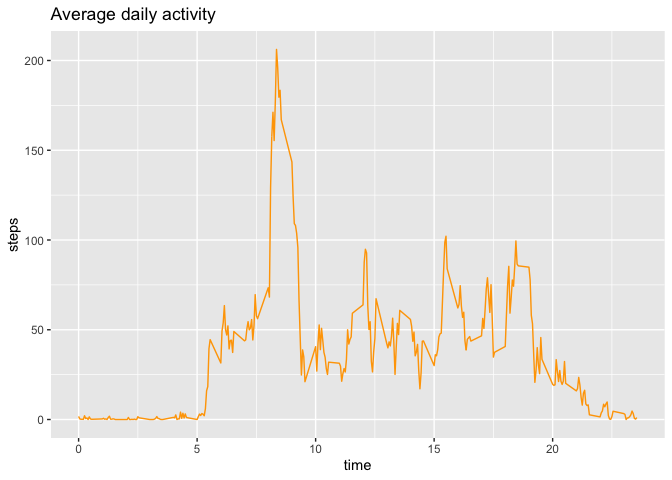
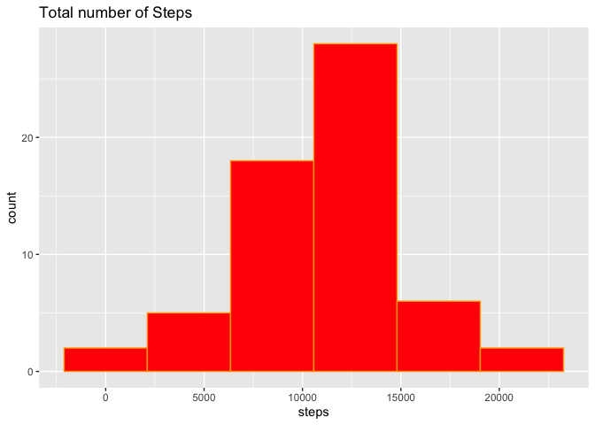
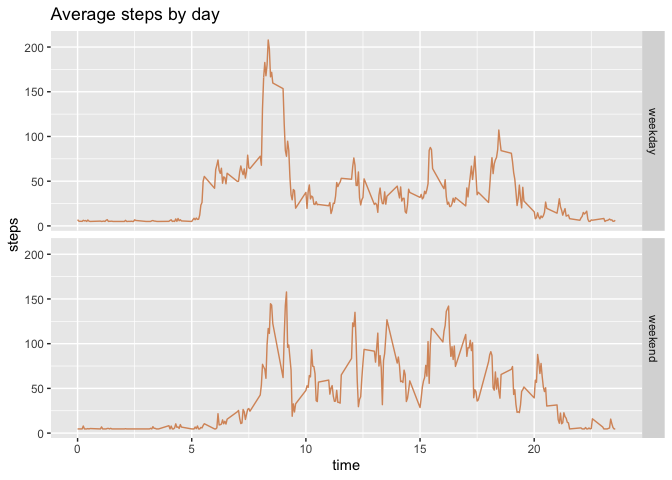

\#\#\#Week 2 Project

First we will load the activity data and lets take a look to the data

    data <- read.csv("activity.csv")
    head(data,n=5)

    ##   steps       date interval
    ## 1    NA 2012-10-01        0
    ## 2    NA 2012-10-01        5
    ## 3    NA 2012-10-01       10
    ## 4    NA 2012-10-01       15
    ## 5    NA 2012-10-01       20

\#\#What is mean total number of steps taken per day?

    library(ggplot2)

    StepsbyDay <- aggregate(steps~date,sum,data = data,na.rm=TRUE)
    ggplot(StepsbyDay,aes(x=steps))+geom_histogram(color="red",fill="orange",bins = 6)+ggtitle("Total number of Steps")

    meansbyday<- as.integer(mean(StepsbyDay$steps))

    mediansbyday <- median(StepsbyDay$steps)

    summary(StepsbyDay$steps)

    ##    Min. 1st Qu.  Median    Mean 3rd Qu.    Max. 
    ##      41    8841   10765   10766   13294   21194

The **mean** of Total Steps by day is 10766 steps .

The **median** of Total Steps by day is 10765 steps.

\#What is the average daily activity pattern?

    Steps.Interval <- aggregate(steps~interval,mean,data = data,na.rm=TRUE)
    ggplot(Steps.Interval,aes(x=interval/100,y=steps))+geom_line(color="orange")+ggtitle("Average daily activity")+xlab("time")

Interval with Max number of steps

    library(dplyr)
    as_tibble(Steps.Interval)%>%filter(steps==max(Steps.Interval$steps))

    ## # A tibble: 1 x 2
    ##   interval steps
    ##      <int> <dbl>
    ## 1      835  206.

\#\#Imputing missing values

1.  How many are missing values?

<!-- -->

    sum(is.na(data$steps))

    ## [1] 2304

The total number of NA´s is \`sum(is.na(data$steps))

2&3)Replace the missing values with the mean and create a new dataset;
the way i figure this out was using a series of subset of the na values
and replace them with the mean.

    newdataset<- data
    newdataset$steps[is.na(newdataset$steps)] <- mean(newdataset$steps, na.rm = T)
    colSums(is.na(newdataset))

    ##    steps     date interval 
    ##        0        0        0

4)Make a histogram of the total number of steps taken each day and
Calculate and report the mean and median total number of steps taken per
day. Do these values differ from the estimates from the first part of
the assignment? What is the impact of imputing missing data on the
estimates of the total daily number of steps?

    StepsbyDay2 <- aggregate(steps~date,sum,data = newdataset,na.rm=TRUE)
    ggplot(StepsbyDay2,aes(x=steps))+geom_histogram(color="orange",fill="red",bins = 6)+ggtitle("Total number of Steps")

    meansbyday2<- as.integer(mean(StepsbyDay2$steps))

    mediansbyday2 <- median(StepsbyDay2$steps)

    summary(StepsbyDay2$steps)

    ##    Min. 1st Qu.  Median    Mean 3rd Qu.    Max. 
    ##      41    9819   10766   10766   12811   21194

The **mean** of Total Steps by day is 10766 steps .

The **median** of Total Steps by day is 1.076618910^{4} steps.

The only difference i found is that with the new values in this data
frame is that we have larger median **10766**&gt;10765.

\#\#Are there differences in activity patterns between weekdays and
weekends? The new dataset with the weekday and DayType:

    newdataset$Date.YMD <- as.Date(newdataset$date, format = "%Y-%m-%d")
    # create a variable with weekdays name
    newdataset$weekday <- weekdays(newdataset$Date.YMD)
    # create a new variable indicating weekday or weekend
    newdataset$DayType <- ifelse(newdataset$weekday=='Saturday' | newdataset$weekday=='Sunday', 'weekend','weekday')
    # see first 10 values
    head(newdataset, n=10)

    ##      steps       date interval   Date.YMD weekday DayType
    ## 1  37.3826 2012-10-01        0 2012-10-01  Monday weekday
    ## 2  37.3826 2012-10-01        5 2012-10-01  Monday weekday
    ## 3  37.3826 2012-10-01       10 2012-10-01  Monday weekday
    ## 4  37.3826 2012-10-01       15 2012-10-01  Monday weekday
    ## 5  37.3826 2012-10-01       20 2012-10-01  Monday weekday
    ## 6  37.3826 2012-10-01       25 2012-10-01  Monday weekday
    ## 7  37.3826 2012-10-01       30 2012-10-01  Monday weekday
    ## 8  37.3826 2012-10-01       35 2012-10-01  Monday weekday
    ## 9  37.3826 2012-10-01       40 2012-10-01  Monday weekday
    ## 10 37.3826 2012-10-01       45 2012-10-01  Monday weekday

Now the panel plot weekday and

    StepsDAYtype <- aggregate(steps~interval+DayType,mean,data =newdataset ,na.rm=TRUE)

    ggplot(StepsDAYtype,aes(x=interval/100,y=steps))+geom_line(color="#D89669")+ggtitle("Average steps by day")+xlab("time")+facet_grid(DayType~.)

